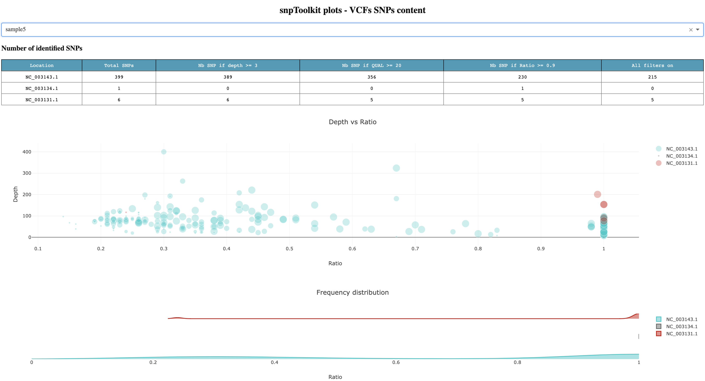

Status: This tutorial is being updated, so keep tuned!


# About

**snpToolkit** is a computational framework written in Python 3. snpToolkit allow users to:

1. Visualize the content of their VCF files
2. Filter SNPs based on multiple criteria:
    - Coordinates of regions to exclude
    - Depth of coverage
    - Quality
    - The ratio corresponding to the number of reads that have the mutated allele / total number of reads at that particular position
3. Annotate SNPs using genome annotation data provided within a genbank file
4. Extract the distribution of all indels according to genome annotation
5. Visualize and explore the annotated SNPs for all analyzed files
6. Combine all snpToolkit output files generated using the annotate option and generate:
    - A table storing the distribution of all SNPs on each sample
    - A fasta file with all concatenated SNPs for each sample. such file can be used to build a phylogenetic tree.

snpToolkit detects automatically if the input vcf files were generated using samtools mpileup, gatk HaplotypeCaller or freebayes. Vcf files could be gzipped or not.

# How to install and update

```bash
#To install 
pip install  git+git://github.com/Amine-Namouchi/snpToolkit.git

#To update
pip install  git+git://github.com/Amine-Namouchi/snpToolkit.git --upgrade
```

# snpToolkit menu

```bash
snptoolkit -h
usage: snptoolkit [-h] {explore,annotate,combine,viz}

    snpToolkit takes vcf files, as well as bam files (optional) as inputs. The vcf files could be generated using samtools/bcftools, 
		gatk HaplotypeCaller or freeBayes.
    Please visit https://github.com/Amine-Namouchi/snpToolkit for more information.

positional arguments:
  {explore,annotate,combine,viz}
                        commands
    explore             explore your vcf files before annotation
    annotate            Please provide one or multiple vcf files
    combine             combine snpToolkit output files in one alignment in fasta format
    viz                 visualize snptoolkit output files

optional arguments:
  -h, --help            show this help message and exit

GPLv3 licence | Amine Namouchi | amine.namouchi@gmail.com
```

For this tutorial we will have 10 vcf files to analyze and compare named sample1.vcf.gz to sample10.vcf.gz. In this example we will work with *Yersinia pestis* so we need the genbank file corresponding to the reference strain used in the alignment process to generate the vcf files. In this case we need the file GCF_000009065.1_ASM906v1_genomic.gbff that can be obtained from [NCBI.](https://www.ncbi.nlm.nih.gov/) 

# The explore command

```bash
snptoolkit explore -h
usage: snptoolkit explore [-h] -i IDENTIFIER

optional arguments:
  -h, --help     show this help message and exit

snpToolkit explore required options:
  -i IDENTIFIER  Provide the input vcf files
```

This command allows user to explore the SNPs on each of their vcf files. 

The option -i  allows to specify a common identifier in the vcf files names. If you want to explore all VCF files in a folder, you can use vcf  as identifier as it is present in all vcf file names (usually filename.vcf.gz). On the contrary, if you have added in the filenames of your vcf files, for example, the years of isolation of each sample, you can use the year you want as identifier. 

when you run the command:

```bash
$ snptoolkit explore -i vcf
[TIME][INFO] [snpToolkit is extracting your data and creating the different plots...]
progress: 100%|#########################################################################| 9/9 [00:00<00:00, 83.75it/s]
Dash is running on http://127.0.0.1:8050/

 * Serving Flask app "explore_snpToolkit" (lazy loading)
 * Environment: production
 * Running on http://127.0.0.1:8050/ (Press CTRL+C to quit)
```

snptoolkit will analyze all raw data on each VCF file in terms of SNPs and starts a web application that you access using the link mentioned above http://127.0.0.1:8050. For this example of 10 vcf files, it took less than a second to analyze all files. Figure 1 shows a screenshot of the generated dashboard to explore your data.



**Figure1**

For sample 5 for example, we can see that the total number of SNPs in the chromosome NC_003143.1 is 399 SNPs. This is the total raw number. Lets detail each column of the first table:

- If we apply just the depth filter (-d) when using the option annotate (see below), only 10 SNPs will be excluded as they have a coverage less than 3.
- If we consider 20 as a cutoff for the quality of each SNPs, the number drop to 356 SNPs
- If we only consider those that have a ratio (nb reads with mutated allele/total number of reads on that position) ≥ 0.9, the number of SNPs drops to 230.
- If all filters are used: depth ≥3, QUAL ≥20 and ratio≥0.9, the number of filtered SNPs will be equal to 215.

For the case of *Yersinia pestis,* there are 3 plasmids. For sample 5, there are SNPs on plasmid NC_003134.1 and NC_003131.1

The first plot in Figure1 shows the distribution of all SNPs based on Ratio (x axis) and Depth (y axis). The size of each circle is proportional to the quality of each SNP. The second plot complement the first plot as it give you an idea about the proportion of SNPs for the chromosome and each of the plasmids. For the chromosome NC_004143.1, we can see that there is a small proportion of SNPs located between 0.2 and 0.4, but most of the SNPs has a high ratio ≥ 0.9. 

To hide any of the data presented on each plot, you just need to select the name that you want. 
