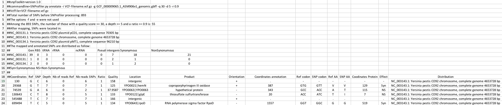
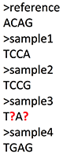

**_snpToolkit_** is a computational framework written in Python 3, that filter, annotate and combine Single Nucleotide Polymorphisms (SNPs) from vcf files generated using **_samtools mpileup_**, **_gatk HaplotypeCaller_** and **_freebayes_**.


##Requirements
---
- Python 3
- Biopython
- pysam
- pandas
- tqdm
- coloredlogs

All these requirements are availble for installation through pip or conda.


##Installation
---

The easiest way to install _snpToolkit_ is through pip: 

```
pip install git+git://github.com/Amine-Namouchi/snpToolkit.git
```


##Usage
---

When using **_snpToolkit_** you have the choice between many options.
```
$ snptoolkit -h
usage: snptoolkit [-h] {explore,annotate,combine,viz} ...

    snpToolkit takes vcf files, as well as bam files (optional) as inputs. The vcf files could be generated using samtools/bcftools, gatk HaplotypeCaller or freeBayes.
    Please visit https://github.com/Amine-Namouchi/snpToolkit for more information.


positional arguments:
  {explore,annotate,combine,viz}
                        commands
    explore             explore your vcf files before annotation
    annotate            Please provide one or multiple vcf files
    combine             combine snpToolkit output files in one alignment in fasta format
    viz                 visualize snptoolkit output files

optional arguments:
  -h, --help            show this help message and exit

GPLv3 licence | Amine Namouchi | amine.namouchi@gmail.com
```


- SNPs filtering and annotion

```
$ snpToolkit annotate -h
usage: snpToolkit annotate [-h] -i IDENTIFIER -g GENBANK [-p PROCESSES]
                           [-f EXCLUDECLOSESNPS] [-q QUALITY] [-d DEPTH]
                           [-r RATIO] [-e EXCLUDE]

optional arguments:
  -h, --help           show this help message and exit

snpToolkit annotate required options:
  -i IDENTIFIER        provide a specific identifier to recognize the file(s)
                       to be analyzed
  -g GENBANK           Pleae provide a genbank

snpToolkit annotate additional options:
  -p PROCESSES         number of vcf files to be annotated in parallel default
                       value [1]
  -f EXCLUDECLOSESNPS  exclude SNPs if the distance between them is lower then
                       the specified window size in bp
  -q QUALITY           quality score to consider as a cutoff for variant
                       calling. default value [20]
  -d DEPTH             minimum depth caverage. default value [3]
  -r RATIO             minimum ratio that correspond to the number of reads
                       that has the mutated allele / total depth in that
                       particular position. default value [0]
  -e EXCLUDE           provide a tab file with genomic regions to exclude in
                       this format: region1 start stop
```

Here is a simple example on how to use snpToolkit:

```
snpToolkit annotate -i VCF-filename.vcf.gz -g genbankFile.gbff -q 30 -d 5 -r 0.9
```

_snpToolkit_ can automatically recogninzes vcf files generated with the following programs: samtools/bcftools, gatk HaplotyCaller and freeBayes. The vcf files could be gzipped or not. In the above command line, _snpToolkit_ will filter and annotate all SNPs in the provided vcf file(s) that fullfil the following criteria: quality >= 30, a depth of coverage >= 5 and a ratio >= 0.9.

>**Note**: For each SNP position, the ratio is calculated as follow:

>dr = number of reads having the reference allele

>dm = number of reads having the mutated allele

>r = dm / (dr + dm)

The generated output file(s) of _snpToolkit_ is a tabulated file(s) that you can open with Microsoft Excel and it will looks as follow:



The header of the generated snpToolkit output file includes useful information eg. raw number of SNPs, Number of filtered SNPs, SNPs distribution, etc...

- Compare and combine multiple annotation files

After generating a set of _snpToolkit_ output files, you can run _snpToolkit_ with the option **combine**.

```
usage: snpToolkit combine [-h] --location LOCATION [-r RATIO] [-d DEPTH]
                          [--bam BAMFOLDER] [--snps {ns,s,all,inter}]
                          [-e EXCLUDE]

optional arguments:
  -h, --help            show this help message and exit

snpToolkit combine required options:
  --location LOCATION         provide for example the name of the chromosome or plasmid you want to create fasta
                        alignment for

snpToolkit additional options:
  -r RATIO              SNP ratio
  -d DEPTH              depth cutoff for checking missing data
  --bam BAMFOLDER       path to the folder containing the bam files
  --snps {ns,s,all,inter}
                        Specify if you want to concatenate all SNPs or just
                        synonymous (s), non-synonymous (ns) or intergenic
                        (inter) SNPs. default [all]
  -e EXCLUDE            provide a text file including the list of genes and genomic coordinates you want to exclude
                        before combining the SNPs.
```

When using the option **combine**, _snpToolkit_ will compared all identified SNPs in each file and create two additional output files: a tabulated files with all polymorphic sites and a fasta file.

As we will be working with ancient DNAs, a small fraction of your genome could be covered. In this case we will use the option **--bam** to indicate the path to the folder containing the bam files of the ancient DNAs. The option **-d** must be used with the option **--bam**. By default, all SNPs will be reported. This behaviour can be changed using the option **--snp**.

>Note: It is also possible to use the option --bam with modern data as some of the genomic regions could be deleted.

The file reporting the polymorphic sites is as follow:

ID|Coordiantes|REF|SNP|Columns with SNP information|sample1|sample2|sample3|sample4
:--- | :--- | :--- | :--- | :--- | :--- | :--- | :--- | :--- | :---
snp1 |130|A|T| |1|1|1|1
snp2 |855|C|G| |0|0|?|1
snp3 |1315|A|C| |1|1|0|0
snp4 |12086|G|A| |1|0|?|0

The above table report the distribution of all polymorphic sites in all provided files. As we provided the bam files of the ancient DNA samples, _snpToolkit_ will check if the polymorphic sites (snp2 and snp4) were not present in sample3 because there is no SNP in that positions or because the region where the snps are located is not covered. In this case, _snpToolkit_ will add <font size="3" color="red"><b>?</b></font> that reflects a missing data.
From the above table, it will be possible to generate a fasta file that will look as follow:


