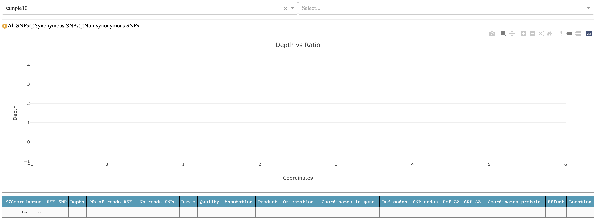

===============
The viz command
===============

.. code-block:: bash

   $ snptoolkit viz -h
   usage: snptoolkit viz [-h] [--dir DIRECTORY] [-p POLYMORPHIC_SITES] [-conf CONFIG]

   optional arguments:
   -h, --help            show this help message and exit

   snpToolkit viz required options:
   --dir DIRECTORY       provide the path of the directory containing snptoolkit SNPs output files
   -p POLYMORPHIC_SITES  provide the path of the polymorphic sites you want to analyze
   -conf CONFIG          provide the path of the configuration file that contains the information to use for data visualization

*******
Visualize snptoolkit annotate command output files
*******

.. code-block:: bash

    ── snpToolkit_SNPs_output_...
       ├── sample3_snpToolkit_SNPs.txt
       ├── sample9_snpToolkit_SNPs.txt
       ├── sample10_snpToolkit_SNPs.txt
       ├── sample1_snpToolkit_SNPs.txt
       ├── sample2_snpToolkit_SNPs.txt
       ├── sample4_snpToolkit_SNPs.txt
       ├── sample5_snpToolkit_SNPs.txt
       ├── sample6_snpToolkit_SNPs.txt
       ├── sample7_snpToolkit_SNPs.txt
       └── sample8_snpToolkit_SNPs.txt

   $ snptoolkit viz --dir snpToolkit_SNPs_output_..
   Dash is running on http://127.0.0.1:8050/

    * Serving Flask app "plot_snpToolkit_output" (lazy loading)
    * Environment: production
    * Debug mode: off
    * Running on http://127.0.0.1:8050/ (Press CTRL+C to quit)

To visualize all snpToolkit outputs,  just access the url `http://127.0.0.1:8050/ <http://127.0.0.1:8050/>`_. 

The first time, you will see one sample selected, in this case sample10, and nothing in the plot and table below. Before to see anything you will need to select for which sequence you want to display the result. For sample10, SNPs where found in the chromosome of *Yersinis pestis* NC_003143.1 and two plasmids: NC_003131.1 and NC_003134.1

.. image:: 5_The_viz_command/Figure3.png
   :target: 5_The_viz_command/Figure3.png
   :alt: 5_The_viz_command/Figure3.png

lets select the chromosome NC_003143.1

The plot shows the genomic distribution of all SNPs according to depth. By default, all SNPs are shown but you can select to visualize only Non-synonymous (orange), Synonymous (blue) and intergenic SNPs (grey). The table below the plot shows all relevant information retrieved from snptoolkit output file for each sample. 

It is possible to filter the table using keywords on each column. In the example below, I used the keyword "transporter" in the column Product.

*******
Analyse snptoolkit combine command output file
*******

The main goal of this analysis is to use two dimentionality reduction methods: PCA and UMAP to cluster all your samples based on the distibution of all identified polymorphic sites between them. Principal Component analysis (PCA) is a quite knowing method and is an unsupervised linear dimensionality reduction and data visualization technique. On the other hand, UMAP is a Uniform Manifold Approximation and Projection for Dimension Reduction. 
From a visualization point of view, PCA tries to preserve the global structure of the data while UMAP tries to preserve global and local structure.
To apply both of these methods you need to provide as input the file **SNPs_polymorphic_sites.txt** generated with the snptoolkit combine command.

.. code-block:: bash

   $ snptoolkit viz -p SNPs_polymorphic_sites.txt
   Dash is running on http://127.0.0.1:8050/

   * Serving Flask app "plot_polySites_output" (lazy loading)
   * Environment: production
      WARNING: This is a development server. Do not use it in a production deployment.
      Use a production WSGI server instead.
   * Debug mode: off
   * Running on http://127.0.0.1:8050/ (Press CTRL+C to quit)

.. note::
   In case you used the option --bam with the snptoolkit combine command, two output files will be generated: SNPs_polymorphic_sites.txt and SNPs_polymorphic_sites_clean.txt. 
   The file SNPs_polymorphic_sites_clean.txt does not contains any missing information indicated with a question mark "?" and should be used as input file for dimentionality reduction.

After running the command *snptoolkit viz -p SNPs_polymorphic_sites.txt*, you can access your result following the link *http://127.0.0.1:8050/*. 

.. note::
   Please note that this step may take some time depending on the size of your data.

The result will be displayed as follows:

PCA
******

As you notice, when you hover of each dot, the name of the corresponding sample will be displayed. 

UMAP
*******

.. image:: 5_The_viz_command/Figure7.png
   :target: 5_The_viz_command/Figure7.png
   :alt: 5_The_viz_command/Figure7.png

Color mapping 
************************

To take a better advantage of these two methods, it is possible to provide a configuration file that contains the metadata about the analyzed samples.
This information will be used for color mapping which will make the visualization more comprehensive.
The configuration file is a tab delimited file. Here is an example:

.. code-block:: bash

   $ less metadata_file 
            Lineage Rifampicin      Isoniazid       Pyrazinamide    Ethambutol      compensatory    Location        MDR
   ERR760737_L4_Argentina_2006     L4      R       R       S       R       YES     Argentina       RR
   ERR037537_L4_Malawi_0   L4      S       S       S       S       NO      Malawi  SS
   ERR2652979_L4_Brazil_2004       L4      S       S       S       S       NO      Brazil  SS
   ERR2652959_L4_Canada_2003       L4      S       S       S       S       NO      Canada  SS
   ERR2653008_L4_Brazil_2004       L4      S       S       S       S       YES     Brazil  SS
   ERR2652915_L4_USA_1999  L4      S       S       S       S       NO      USA     SS
   ERR245833_L1_Malawi_0   L1      S       S       S       S       YES     Malawi  SS
   ERR037471_L4_Malawi_0   L4      S       S       S       S       NO      Malawi  SS
   ERR037549_L4_Malawi_0   L4      S       S       S       S       YES     Malawi  SS
   ERR245675_L1_Malawi_0   L1      S       S       S       S       YES     Malawi  SS
   ERR760755_L4_Argentina_2006     L4      R       R       S       R       YES     Argentina       RR

.. note::
   Please note that the configuration file must contains all the samples that are present in the input file SNPs_polymorphic_sites.txt.
   In case not all the information is availble, you can just any label on the corresponding cells e.g. NA for not availble. 
   

lets run the command viz with the configuration file:

.. code-block:: bash

   $ snptoolkit viz -p SNPs_polymorphic_sites.txt -conf metadata_file

   Dash is running on http://127.0.0.1:8050/

   * Serving Flask app "plot_polySites_output" (lazy loading)
   * Environment: production
      WARNING: This is a development server. Do not use it in a production deployment.
      Use a production WSGI server instead.
   * Debug mode: off
   * Running on http://127.0.0.1:8050/ (Press CTRL+C to quit)

As you can see below, now the dropdown menu shows the list of features to use for coloring the different samples. 

.. image:: 5_The_viz_command/Figure8.png
   :target: 5_The_viz_command/Figure8.png
   :alt: 5_The_viz_command/Figure8.png

Now lets color the samples based on their resistance to rifampicin

Now lets  color the samples based on their location

For those (like me) that like dark mode in general you can turn it on to get graphs with dark bakground. 

