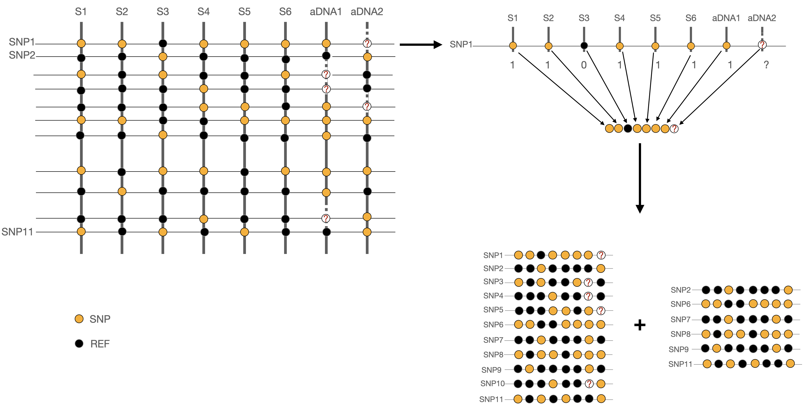
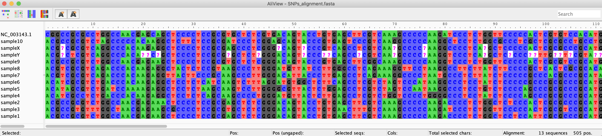
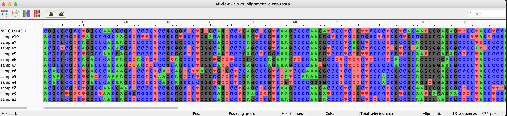

The combine command
===================

.. code-block:: bash

   $ snptoolkit combine  -h
   usage: snptoolkit combine [-h] --loc LOCATION [-r RATIO] [--bam BAMFILTER BAMFILTER BAMFILTER] [--snps {ns,s,all,inter}] [-e EXCLUDE]

   optional arguments:
     -h, --help            show this help message and exit

   snpToolkit combine required options:
     --loc LOCATION   provide for example the name of the chromosome or plasmid you want to create fasta alignemnt for

   snpToolkit additional options:
     -r RATIO              new versus reference allele ratio to filter SNPs from snpToolkit outputs. default [0]
     --bam BAMFILTER BAMFILTER BAMFILTER
                           provide the depth, ratio and the path to the folder containing the bam files. eg. 3 0.9 path
     --snps {ns,s,all,inter}
                           Specify if you want to concatenate all SNPs or just synonymous (s), non-synonymous (ns) or intergenic (inter) SNPs. default [all]
     -e EXCLUDE            Provide a yaml file with keywords and coordinates to be excluded

--------
Options
--------

======================= ========
Option                  Description
======================= ========
**--loc**               The name of chromosome or plasmid you want to concatenate the SNPs for. This can be found in the last coloumn of the output file of the annotate command
======================= ========

Several options are additional: 

=======================  ========
Option                   Description
=======================  ========
**--bam**                This option takes three parameters in the following order: depth ration path_to_bam_files. See below for more details
**--snps**               Type of SNPs to be concatenated. default [all]
**-r**                   r = M/M+R  where **M** is the number of reads that carry the mutated allele and **R** is the is the number of reads that carry the reference allele. If not specified all SNPs will be taken into account.
**-e**                   This is to specify a yaml file with two arguments KEYWORDS and COORDINATES. See below for more details 
=======================  ========

The command combine should be run in the directory containing the snpToolkit output files generated using the annotate command. 

.. code-block:: bash

   ├── sample1_snpToolkit_SNPs.txt
   ├── sample3_snpToolkit_SNPs.txt
   ├── sample5_snpToolkit_SNPs.txt
   ├── sample9_snpToolkit_SNPs.txt
   ├── sample10_snpToolkit_SNPs.txt
   ├── sample2_snpToolkit_SNPs.txt
   ├── sample4_snpToolkit_SNPs.txt
   ├── sample6_snpToolkit_SNPs.txt
   ├── sample7_snpToolkit_SNPs.txt
   ├── sample8_snpToolkit_SNPs.txt

----------------------------
Running the combine command 
----------------------------

.. code-block:: bash

   $ snptoolkit combine  --loc NC_003143.1
   [09:33:38] [INFO] [Searching for polymorphic sites...]
   [09:33:38] [INFO] [SNPs polymorphic sites distribution. Please wait...]
   progress: 100%|##############################################################################| 490/490 [00:00<00:00, 20233.61it/s]
   [09:33:38] [INFO] [Creating SNPs_polymorphic_sites.txt]
   [09:33:38] [INFO] [Creating SNPs_alignment.fasta]
   progress: 100%|##############################################################################| 10/10 [00:00<00:00, 4712.17it/s]

In the command above, the first step is to search for all polymorphic sites. A total number of 490 SNPs was found. As we didnt use the -r option, all SNPs were analyzed. The minimum ratio in this case will be 0.9

.. note::
   It is important to remember that these snpToolkit output files were generated with the following command:

   snptoolkit annotate -i vcf -g GCF_000009065.1_ASM906v1_genomic.gbff -d 5 -q 30 -r 0.9 -p 4

   all annotated SNPs  will have at least a depth of 5 and a ratio of 0.9. 

Now lets run the command above with the option -r 1

.. code-block:: bash

   $ snptoolkit combine  --loc NC_003143.1 -r 1
   [10:06:27] [WARNING] [SNPs_polymorphic_sites.txt exists already and was created on Thu Oct 22 09:44:43 2020. This file will be replaced. 
                                               Press any key to continue or ctrl-c to exit!]
   [10:06:28] [INFO] [Searching for polymorphic sites...]
   [10:06:28] [INFO] [SNPs polymorphic sites distribution. Please wait...]
   progress: 100%|#################################################################################| 470/470 [00:00<00:00, 22782.49it/s]
   [10:06:28] [INFO] [Creating SNPs_polymorphic_sites.txt]
   [10:06:28] [INFO] [Creating SNPs_alignment.fasta]
   progress: 100%|#################################################################################| 10/10 [00:00<00:00, 9736.08it/s]

As the file SNPs_polymorphic_sites.txt exists already, snpToolkit warn you that you need to change the file name or it will be replaced by the new output file. 

As we requested that for all SNPs, 100% of the reads must have the new allele, the number of polymorphic sites is now 470. 

The Polymorphic sites output SNPs_polymorphic_sites.txt is as follows:

.. code-block:: bash

   ##snpToolkit=version
   ##commandline= snptoolkit combine --loc NC_003143.1 -r 1
   ##location=NC_003143.1
   ##Number of polymorphic sites= 470
   ##ID    Coordinates     REF     SNP     Location        Product Orientation     NucPosition     REF-codon       NEW-codon       REF-AA  NEW-AA  ProPostion      Type    sample10        sample9 sample8 sample7 sample6 sample5 sample4 sample2 sample3 sample1
   snp1    82      C       A       intergenic      .       +       .       -       -       -       -       -       -       1       1       1       1       1       1       1       1       1       1
   snp2    130     G       C       intergenic      .       +       .       -       -       -       -       -       -       1       1       1       1       1       1       1       1       1       1
   snp3    855     G       A       YPO_RS01010|asnC        transcriptional regulator AsnC  -       411     ACC     AC[T]   T       T       137     Syn     0       0       0       0       1       1       1       0       0       0
   snp4    18061   C       T       YPO_RS01090|YPO_RS01090 IS256 family transposase        +       156     AAC     AA[T]   N       N       52      Syn     0       0       1       1       1       1       1       0       0       0
   snp5    21219   C       A       YPO_RS01110|YPO_RS01110 serine/threonine protein kinase +       428     GCC     G[A]C   A       D       143     NS      0       0       0       0       0       1       0       0       0       0
   snp6    42303   C       T       YPO_RS01190|fabY        fatty acid biosynthesis protein FabY    +       897     GTC     GT[T]   V       V       299     Syn     0       0       0       0       0       0       0       0       1       0
   snp7    61685   G       C       intergenic      .       +       64 bp from YPO_RS01280|YPO_RS01280      .       .       .       .       .       .       0       0       0       0       0       0       1       0       0       0
   snp8    74539   C       T       YPO_RS01350|envC        murein hydrolase activator EnvC -       361     GCC     [A]CC   A       T       121     NS      1       1       1       1       1       1       1       1       1       1
   snp9    76590   C       T       intergenic      .       +       .       -       -       -       -       -       -       0       0       0       0       0       0       0       0       1       0
   snp10   90931   T       A       YPO_RS01440|YPO_RS01440 molybdate ABC transporter substrate-binding protein     -       578     CAG     C[T]G   Q       L       193     NS      0       0       1       1       0       0       0       0       0       0

The first lines of this file contain a summary and useful information. The SNPs annotation is organized in tab delimited table. The columns of this table are:

=======================  ========
Column name              Description
=======================  ========
ID                       Identifiier of the SNP
Coordinates              SNP coordinate
REF                      Reference allele
SNP                      New allele in analyzed sample
Locatio                  location within the genome
Product                  Functional product of the gene
Orientation              Gene orientation
NucPosition              gene Coordinate of the SNP within the gene
REF-codon                Reference codon
NEW-codon                New codon
Ref AA                   Amino Acid corresponding to reference codon
SNP AA                   Amino Acid corresponding to new codon
ProPostion               Coordinate of the Amino Acid
Type                     Could be Synonymous (Syn) or Non-Synonymous (NS), or (.) for intergenic
=======================  ========

After these columns, each column will represented one analyzed sample. The presence or absence of each SNP is represented by 1 or 0, respectively. 

In addition to the SNPs_polymorphic_sites.txt, snpToolkit will also generates a fasta file SNPs_alignment.fasta containing the concatenation of all polymorphic sites on each sample.

.. code-block:: bash

   $ grep '>' SNPs_alignment.fasta
   >NC_003143.1
   >sample10
   >sample9
   >sample8
   >sample7
   >sample6
   >sample5
   >sample4
   >sample2
   >sample3
   >sample1

The first sequence is the reference sequence followed by the 10 samples used for this example

--------------------------------
Find and Include Missing data
--------------------------------

Lets now suppose that we have two ancient DNA samples that we have analyzed and generated the corresponding vcf files. When working with aDNA, usually not 100% of your genome is recovered. When looking for the distribution of all polymorphic sites within these aDNA, it is important to know if an SNP was not identified because for that position the aDNA is similar to the reference or because the region is not covered at all. To be able to identify such position, users have to provide the bam files of all samples for whom  they want to account for missing data.

.. code-block:: bash

   snptoolkit combine -r 0.9 --loc NC_003143.1 --bam 2 1.0 ../bam/

As you can see, you need just to specify one addition option '- -bam' with three parameter 

.. code-block:: bash

   --bam 2 1.0 ../bam/

=======================  ========
Parameter                Description
=======================  ========
2                        Minimum depth of coverage to consider. Here this depth is set to 2, which mean that at least 2 reads should be found 
1.0                      Number of reads with new allele /  total number of reads ratio. For this example it is set to 1.0, which mean that the 2 reads should have the new allele
../bam                   This is the path of the folder containing the bam files of all aDNA to be considered. The bam folder should also include the .bai files 
=======================  ========

.. note::
   When using the --bam option, snptoolkit will create in total 4 output files:

   * SNPs_polymorphic_sites.txt + SNPs_alignment.fasta
   * SNPs_polymorphic_sites_clean.txt + SNPs_alignment.fasta

   As described above, The first two files contains all SNPs found in all analysed samples including polymorphic sites where in some samples there is missing information indicated by a question mark.
   The second two files are a "clean" version of the two files described above in the sence that they don't contain any position where missing information is reported.

.. code-block:: bash

   ├── [ 19M ]  sampleY.bam
   ├── [ 33M ]  sampleX.bam
   ├── [ 14K ]  sampleX.bam.bai
   └── [6.6K ]  sampleY.bam.bai

Now lets run the combine command on all snpToolkit output files generated using the annotate command:

.. code-block:: bash

   ├── [ 10K ]  sample9_snpToolkit_SNPs.txt
   ├── [ 10K ]  sampleY_snpToolkit_SNPs.txt
   ├── [ 32K ]  sample10_snpToolkit_SNPs.txt
   ├── [ 15K ]  sample1_snpToolkit_SNPs.txt
   ├── [ 15K ]  sample2_snpToolkit_SNPs.txt
   ├── [ 12K ]  sample3_snpToolkit_SNPs.txt
   ├── [ 35K ]  sample4_snpToolkit_SNPs.txt
   ├── [ 36K ]  sample5_snpToolkit_SNPs.txt
   ├── [ 38K ]  sample6_snpToolkit_SNPs.txt
   ├── [ 37K ]  sample7_snpToolkit_SNPs.txt
   ├── [ 16K ]  sampleX_snpToolkit_SNPs.txt
   ├── [ 41K ]  sample8_snpToolkit_SNPs.txt

.. code-block:: bash

   $ snptoolkit combine -r 0.9 --loc NC_003143.1 --bam 2 1.0 ../bam/
   [10:45:48] [INFO] [Searching for polymorphic sites...]
   [10:45:48] [INFO] [SNPs polymorphic sites distribution. Please wait...]
   progress: 100%|############################################################################################################################################################################################| 505/505 [00:04<00:00, 112.91it/s]
   [10:45:52] [INFO] [Creating SNPs_alignment.fasta]
   progress: 100%|#############################################################################################################################################################################################| 12/12 [00:00<00:00, 8558.35it/s]
   [10:45:52] [INFO] [Creating SNPs_polymorphic_sites_clean.txt]
   progress: 100%|#########################################################################################################################################################################################| 375/375 [00:00<00:00, 183381.60it/s]
   [10:45:52] [INFO] [Creating SNPs_alignment_clean.fasta]
   progress: 100%|############################################################################################################################################################################################| 12/12 [00:00<00:00, 12738.96it/s]

By adding the two aDNA samples, the number of polymorphic sites has increased to 505.  The new SNPs_polymorphic_sites.txt contains now the SNPs distribution for sampleX and sampleY. 

.. code-block:: bash

   ##commandline= snptoolkit combine -r 0.9 --loc NC_003143.1 --bam 2 1.0 ../bam/
   ##location=NC_003143.1
   ##Number of polymorphic sites= 505
   ##ID    Coordinates     REF     SNP     Location        Product Orientation     NucPosition     REF-codon       NEW-codon       REF-AA  NEW-AA  ProPostion      Type    sample10        sampleX sampleY sample9 sample8 sample7 sample6 sample5 sample4 sample2 sample3 sample1
   snp1    82      C       A       intergenic      .       +       .       -       -       -       -       -       -       1       1       1       1       1       1       1       1       1       1       1       1
   snp2    130     G       C       intergenic      .       +       .       -       -       -       -       -       -       1       1       1       1       1       1       1       1       1       1       1       1
   snp3    855     G       A       YPO_RS01010|asnC        transcriptional regulator AsnC  -       411     ACC     AC[T]   T       T       137     Syn     0       0       0       0       0       0       1       1       1       0       0       0
   snp4    18061   C       T       YPO_RS01090|YPO_RS01090 IS256 family transposase        +       156     AAC     AA[T]   N       N       52      Syn     0       ?       ?       0       1       1       1       1       1       0       0       0
   snp5    21219   C       A       YPO_RS01110|YPO_RS01110 serine/threonine protein kinase +       428     GCC     G[A]C   A       D       143     NS      0       0       0       0       0       0       0       1       0       0       0       0
   snp6    29368   G       T       YPO_RS01140|hemN        oxygen-independent coproporphyrinogen III oxidase       +       387     GTG     GT[T]   V       V       129     Syn     0       0       1       0       0       0       0       0       0       0       0       0
   snp7    42303   C       T       YPO_RS01190|fabY        fatty acid biosynthesis protein FabY    +       897     GTC     GT[T]   V       V       299     Syn     0       0       0       0       0       0       0       0       0       0       1       0
   snp8    61685   G       C       intergenic      .       +       64 bp from YPO_RS01280|YPO_RS01280      .       .       .       .       .       .       0       0       0       0       0       0       0       0       1       0       0       0
   snp9    74539   C       T       YPO_RS01350|envC        murein hydrolase activator EnvC -       361     GCC     [A]CC   A       T       121     NS      1       1       1       1       1       1       1       1       1       1       1       1

For snp4, this SNP is considered as "?" as at position 18061 the criteria minimum 2 reads AND ratio 1.0 were not satisfied 

.. code-block:: bash

   ##ID    Coordinates     REF     SNP     Location        Product Orientation     NucPosition     REF-codon       NEW-codon       REF-AA  NEW-AA  ProPostion      Type    sample10        sampleX sampleY sample9 sample8 sample7 sample6 sample5 sample4 sample2 sample3 sample1
   snp4    18061   C       T       YPO_RS01090|YPO_RS01090 IS256 family transposase        +       156     AAC     AA[T]   N       N       52      Syn     0       ?       ?       0       1       1       1       1       1       0       0       0

Lets take a look now at the file SNPs_alignment.fasta:

The file SNPs_polymorphic_sites_clean.txt contains only 375 SNPs instead of 505 as 130 polymorphic sites contain missing information. 

.. code-block:: bash

   ##commandline= snptoolkit combine -r 0.9 --loc NC_003143.1 --bam 2 1.0 ../bam/
   ##location=NC_003143.1
   ##Number of polymorphic sites= 375
   ##ID    Coordinates     REF     SNP     Location        Product Orientation     NucPosition     REF-codon       NEW-codon       REF-AA  NEW-AA  ProPostion      Type    sample10        sampleX sampleY sample9 sample8 sample7 sample6 sample5 sample4 sample2 sample3 sample1
   snp1    82      C       A       intergenic      .       +       .       -       -       -       -       -       -       1       1       1       1       1       1       1       1       1       1       1       1
   snp2    130     G       C       intergenic      .       +       .       -       -       -       -       -       -       1       1       1       1       1       1       1       1       1       1       1       1
   snp3    855     G       A       YPO_RS01010|asnC        transcriptional regulator AsnC  -       411     ACC     AC[T]   T       T       137     Syn     0       0       0       0       0       0       1       1       1       0       0 0
   snp4    21219   C       A       YPO_RS01110|YPO_RS01110 serine/threonine protein kinase +       428     GCC     G[A]C   A       D       143     NS      0       0       0       0       0       0       0       1       0       0       0 0
   snp5    29368   G       T       YPO_RS01140|hemN        oxygen-independent coproporphyrinogen III oxidase       +       387     GTG     GT[T]   V       V       129     Syn     0       0       1       0       0       0       0       0 0       0       0       0
   snp6    42303   C       T       YPO_RS01190|fabY        fatty acid biosynthesis protein FabY    +       897     GTC     GT[T]   V       V       299     Syn     0       0       0       0       0       0       0       0       0       0 1       0
   snp7    61685   G       C       intergenic      .       +       64 bp from YPO_RS01280|YPO_RS01280      .       .       .       .       .       .       0       0       0       0       0       0       0       0       1       0       0 0
   snp8    74539   C       T       YPO_RS01350|envC        murein hydrolase activator EnvC -       361     GCC     [A]CC   A       T       121     NS      1       1       1       1       1       1       1       1       1       1       1 1
   snp9    76590   C       T       intergenic      .       +       .       -       -       -       -       -       -       0       0       0       0       0       0       0       0       0       0       1       0

Lets take a look now at the file SNPs_alignment_clean.fasta that compared to SNPs_alignment.fasta does not contain polymorphic site with missing information.

----------------
Excluding SNPs 
----------------
For the combine command it is possible also to provide a file that includes the SNPs to exclude with the option -e when searching for all polymorphic sites and building the fasta file. Compared to the annotate command, the file here must be in yaml format and not a tabulated format. Here is an example:

   KEYWORDS: YPO3746;YPO3747

   COORDINATES: 64265;7662

The yaml file has two arguments: KEYWORDS and COORDINATES. With the argument KEYWORDS you can specify genes names, a word within a product name, etc... 

* If you specify a gene name, all SNPs within that gene will be excluded.
* If you specify for example 'cytochrome', all genes having the word cytochrome in their product will be ignored.

For the argument COORDINATES, it is straightforward, it will contains the list of SNP positions to be excluded.

The rational behind this choice of file structure is that after creating the files SNPs_polymorphic_sites.txt and SNPs_alignment.fasta, and making some downstream analyses like building phylogenetic trees and checking some SNPs for confirmation, it is possible to exclude for example SNPs that are in regions that included some repeats or a family of genes that has duplicated genes... such file will give all the flexibility for users. 

.. note::
   In the next version of snpToolkit, it will be possible instead of providing the bam files, to search back the original vcf files if only they include all the positions and not only variable sites:

   * With samtools mpileup you can use the option -aa to output all positions, including unused reference sequences.
   * With gatk haplotypeCaller you can use mode EMIT_ALL_SITES  with the option -output-mode
